# Roadmap

**Where Atelier is going, drawn as an opportunity solution tree: one outcome, the problems that stand between
people and it, what was built or will be built for each, and the test that decides whether it worked. Every branch
carries its reason.**

## The outcome

From a folder of examples and a prompt, a person gets a skill that is better than a careful hand-written one, and
can rely on it without reading every draft.

It is counted against two public hand-written skills
([i-have-adhd](https://github.com/ayghri/i-have-adhd) for answers,
[stop-slop](https://github.com/hardikpandya/stop-slop) for writing), on four axes (quality, the owner's rules,
repeatability, voice). The bar is at least 20% fewer failures and clearly fewer
([decision 0012](decisions/0012-the-closing-rules.md)). Each claim is tested once by someone who is not the builder,
and a miss is published as a miss.

## The tree

```mermaid
flowchart TD
  O["OUTCOME<br/>From examples and a prompt:<br/>a skill better than a hand-written one,<br/>trusted without reading every draft"]

  O --> P1["I can't tell whether the output<br/>still follows my rules"]
  O --> P2["It invents things<br/>I never said"]
  O --> P3["Its answers are worse than<br/>a careful hand-written skill's"]
  O --> P4["It doesn't sound like me"]
  O --> P5["The skill is too big and the<br/>checked run costs too much"]
  O --> P6["It takes too long to get<br/>a working skill"]

  P1 --> S1a["A standard approved once,<br/>hashed, checked on every output"]:::shipped
  P1 --> S1b["Strict delivery:<br/>only a conformant output ships"]:::testing
  P2 --> S2a["A claim reader qualified<br/>on planted inventions"]:::shipped
  P3 --> S3a["A habit is carried no wider<br/>than the examples support"]:::shipped
  P3 --> S3b["The closing test against<br/>two hand-written skills"]:::next
  P4 --> S4a["Whole pieces and a persona,<br/>each point quoted from the author"]:::shipped
  P4 --> S4b["A last in-context voice read,<br/>by people, blind"]:::next
  P4 --> S4c["A trained voice adapter"]:::later
  P5 --> S5a["Size by part and cost by purpose,<br/>on every skill and every run"]:::shipped
  P5 --> S5b["A budget for the author's pieces,<br/>and excerpts in place of whole pieces"]:::testing
  P5 --> S5c["One draft first,<br/>a small model first"]:::later
  P6 --> S6a["Install from npm,<br/>one command to connect an agent"]:::testing
  P6 --> S6b["Review the few rules that decide<br/>most outputs, accept the rest"]:::later
  P6 --> S6c["Ready-made standards,<br/>a check on pull requests"]:::later

  classDef shipped fill:#d7f0dd,stroke:#2f7d45,color:#12351d;
  classDef testing fill:#fdf1c7,stroke:#a67c00,color:#3d2e00;
  classDef next fill:#dbe9fb,stroke:#2b62b3,color:#11284a;
  classDef later fill:#ececec,stroke:#7a7a7a,color:#2b2b2b;
```

Green is built and has a measurement behind it, some of it not yet in a tagged release. Yellow is built and waiting
for its measurement. Blue is the next test. Gray is
decided for later, with its condition. The problems are in the words people used for them; the evidence under each
is in [RESULTS](RESULTS.md).

## Branch by branch: what, why, and the test

### 1. "I can't tell whether the output still follows my rules"

**Why it matters.** A skill nobody can check has to be read draft by draft, which is the work it was meant to save.

| Solution | State | The evidence, or the test that decides |
|---|---|---|
| A standard the owner approves once, hashed, that no automated step can change | Shipped | The standard's hash never moved through diagnosis, a new version, a rerun and a settlement ([moat result](../studies/MOAT_RESULT.md)) |
| Counted checks on every output, with a pass or fail a person can read | Shipped | In development, answers breaking a counted rule: 31% against 76% for a hand-written skill on coding answers, 0% against 10% on contract clauses, 10% against 95% on code review |
| Strict delivery: an output ships only when it conforms | Built, opt-in | It refused 7 of 80 answers on one rule; the cause is fixed and is measured again in the last development round. Claim B tests it across three kinds of work |

### 2. "It invents things I never said"

**Why it matters.** One invented figure in a post costs more trust than every rule held.

| Solution | State | The evidence, or the test that decides |
|---|---|---|
| A small model reads each draft for specifics; code decides whether each is supported | Shipped, qualified | All 46 planted inventions caught and 39 of 48 clean drafts left alone at its production settings ([v3 result](../studies/CLAIM_READER_V3_QUALIFICATION_RESULT.md)) |
| Only a measured instrument may cut text | Shipped | An unqualified reader reports and never deletes ([decision 0003](decisions/0003-authority-by-measurement.md)) |

### 3. "Its answers are worse than a careful hand-written skill's"

**Why it matters.** This is the bar the owner signed: better than a skill a person wrote by hand.

| Solution | State | The evidence, or the test that decides |
|---|---|---|
| A habit is stated only on evidence, and one that holds back what was asked is the owner's to rule on | Shipped | Fourteen of fifteen lost cases had one cause: the skill withheld what was asked. After the change, failed answers were 15.0% against 25.4% on 60 held-out coding tasks ([decision 0013](decisions/0013-carried-no-wider-than-the-corpus.md)) |
| The closing test, four claims, once each, by an independent tester | Next | [The brief](../studies/INDEPENDENT_TEST_BRIEF.md). A FAIL closes the claim for the 1.x line |
| Writing, on the hand-written skill's own score | Open, measured behind | 2.4 and 3.5 points of 50 lower on two authors. It is published as it stands |

### 4. "It doesn't sound like me"

**Why it matters.** Rules describe a writer; they do not sound like one. This is the least solved branch.

| Solution | State | The evidence, or the test that decides |
|---|---|---|
| The author's own pieces and a persona quoted from them, served with the skill | Shipped; voice not claimed | Exploratory blind rounds on one author: a skill of rules alone was ranked least like the author, and a later one with a description and whole pieces was preferred on the two briefs read. The pre-registered gate of those rounds failed |
| How typical an output is of the author, against the author's own floor | Shipped, an instrument | An author's own pieces are told from each other at AUC 0.72 to 0.81, so a reading is compared with that and not with 0.5 ([author floor](../studies/AUTHOR_FLOOR_RESULT.md)) |
| Plan-first writing, bands near the request's subject, a structure reader | Tried, failed | Plan-first: every arm was still told from the author's unseen pieces, AUC 0.75 to 1.0 ([indistinguishability](../studies/INDISTINGUISHABILITY_RESULT.md)). Bands near the subject told the author from the model no better ([context bands](../studies/CONTEXT_BANDS_RESULT.md)). The structure reader was reliable and separated nothing ([structure reader](../studies/STRUCTURE_READER_RESULT.md)) |
| One last in-context voice read, by people, blind | Next | Claim C. If it fails, voice is not claimed in 1.x and no further prompting round is run |
| A trained voice adapter | After the closing test | See "Exploration" below: the published evidence favours a model trained on the author over one prompted with their examples |

### 5. "The skill is too big and the checked run costs too much"

**Why it matters.** A reviewer measured Atelier's exported skills at 5,035 to 13,818 words against 189 to 1,240 for
the skills they were compared with. Size costs context in an agent, latency and attention. The checked runtime costs
about seven times the plug-in.

| Solution | State | The evidence, or the test that decides |
|---|---|---|
| Every skill states its size, stored and exported, with the export by part | Built | On the one skill measured part by part, 9,201 of 13,173 words are the author's whole pieces, set by one budget |
| Every run says where its cost went, by purpose | Built | Two drafts explain at most two of the seven times; the rest is unmeasured until real runs report it |
| A word budget for the author's pieces, and excerpts from more pieces in place of a few whole ones | Built, opt-in | [One study, drafted](../studies/EFFICIENCY_ABLATION_PREREGISTRATION.md): four smaller configurations of each of two writing skills against today's, read on the author's rules and on quality. The smaller of two (none of the author's pieces, or whole pieces within 3,000 words) becomes the default if it is rejected in neither domain; excerpts are measured for the next version. If nothing is selected the size stays, and the study will not have shown that the size buys anything: its error rates are large both ways ([decision 0014](decisions/0014-the-smallest-realization-that-holds-the-standard.md)) |
| One draft first and a second only on evidence; a small model first and a strong one only on refusal | 2.0 | Each changes how a run spends, so each waits for the cost breakdown from real runs |
| Sending only the rules that apply to a request | 2.0 | On the one skill measured, the rules and their examples are a fifth of the export, and a wrong "does not apply" silently drops a rule the owner required |

### 6. "It takes too long to get a working skill"

**Why it matters.** Most people will say "review code the way our principal engineer does", not "ratify a
standard". Today a build proposes twenty to forty-odd rules and prints its internals.

| Solution | State | The evidence, or the test that decides |
|---|---|---|
| Install from npm, and one command that connects the agents in a project | Built, not yet published to npm | `atelier setup` works from a source install today; the package is published with the next tagged release |
| A review that shows the few rules that decide most outputs first, and one line of output with the detail behind `atelier report` | 2.0, first | Time from a folder of examples to a first accepted output |
| A check on pull requests: `atelier verify` on docs, release notes and changelogs | 2.0 | A broken REQUIRED rule fails the check, and the run's panel is the comment |
| Ready-made standards from authors who agreed to be listed; one standard shared by a team and checked in CI | 2.0 | Whether a team keeps a standard in its repository |

## The order from here

1. **One study of size.** The reviewer measures five configurations of two skills once, by a rule sealed first.
2. **One build:** exactly the configuration the rule selects, with today's prepared beside it as the fallback.
3. **The last development round,** on that commit: the strict-delivery fix, the final export on every held-out task,
   the four axes, and ten blind pairs read by the owner.
4. **The closing test:** four claims, once each, by an independent tester, on one frozen commit.
5. **Publish every result,** pass or miss, tag the release, and close the 1.x line.
6. **2.0** starts from time to a working skill.

Nothing is added between these steps because a result disappointed.

## Also waiting on evidence

- **A head-to-head with GEPA and SkillOpt at a fair budget, on a sealed test.** A development run at small budgets
  found Atelier breaking fewer of the author's rules in 5 of 6 comparisons, with much larger skills. The kit is in
  [bench/compare](https://github.com/yannickYamo/atelier/tree/main/bench/compare). It never blocks a claim.
- **A skill looked after for weeks.** The loop that tends a skill is built and tested offline, and has never run on a
  live skill over time.
- **Other domains, measured.** Contracts, financial reports and support replies run today and have been only partly
  measured ([CROSS_DOMAIN_PREREGISTRATION](../studies/CROSS_DOMAIN_PREREGISTRATION.md)).
- **Search under a fixed standard** ([decision 0004](decisions/0004-search-under-a-fixed-standard.md)): a search over
  how rules are carried, with no operation that can edit the standard. No measured defect of 1.x needs it.

## Exploration, after the closing test

Nothing here is built, and nothing here starts before the closing test's results are in the README
([decision 0012](decisions/0012-the-closing-rules.md)).

- **A trained voice adapter.** Every attempt at the implicit layer of a voice (rhythm, word choice) used prompting,
  and every test of it failed. The published evidence points the other way: in a study of 50 authors, expert readers
  disfavoured text prompted with an author's examples and preferred text from a model fine-tuned on the author's
  work ([arXiv 2510.13939](https://arxiv.org/abs/2510.13939)). The idea is a small open-weight model with a low-rank
  adapter (LoRA) that rewrites a checked draft paragraph by paragraph into the author's voice. The frontier model
  still writes the content and Atelier still checks it; the adapter is one more way of carrying the standard, hashed,
  recorded with every output and rolled back like any release.

  **The open question is how little writing is enough.** Three 300-word essays are about 1,200 tokens. An adapter
  trained on that learns the three essays, not the author: it copies their sentences and their subjects. So the
  exploration is tiered by how much the author has written, and each tier is a hypothesis to test, not a design:

  | The author's corpus | What to try | Why |
  |---|---|---|
  | a few short pieces | no training on the author. The pieces go in the prompt, and a **shared** adapter does the rewriting | the corpus fits in context; what can be trained once, on many consenting authors, is the skill of imitating from a few examples |
  | tens of pieces | the shared adapter, then a light adapter for the author on top | enough paragraphs to hold some back and stop training when the held-back ones stop improving |
  | a large body of work | an adapter for the author | the case the published result covers |

  A second shared adapter needs no author data at all: one trained to remove machine-writing habits. The same study
  found readers penalised prompted text mainly for those habits, more than for any missing habit of the author.

  **How the training data would be made.** From the pair bank Atelier already builds: each of the author's paragraphs
  beside the same facts in plain words, the model learning plain to author. Several plain versions of one paragraph
  multiply the examples without inventing a word of the author's. Two rules: the author's side of a pair is always
  their real text, never a model's imitation of it; and question-and-answer pairs made from the pieces are not
  used, because they teach what the author said, not how they say it.

  **A first configuration to test, not a recommendation:** a Llama-class instruct model of a few billion parameters;
  low rank (4 to 8) on the attention projections only; one to three epochs at a low learning rate with dropout; the
  checkpoint chosen on held-back pieces, never on training loss; and a copying check on every candidate (no run of
  twelve words from the corpus).

  **What stays out of the weights.** Voice may be trained. Facts about the person may not: a model that has memorised
  them will also invent them. What the author knows and has done stays supplied material, checked as it is today.

  **What must be true before anything is built** ([decision 0009](decisions/0009-voice-below-the-standard.md)): the
  gate that refuses a rewrite which changed a claim is qualified; the author agreed to their writing being trained
  on; and a feasibility read comes first, on one consenting author with a large body of work, using a hosted
  fine-tune so that no infrastructure is built to find out whether people prefer the result. If they do not, this
  stops there.

## Not doing

- **Letting any automated step change a rule.** It is what makes the standard yours
  ([0001](decisions/0001-standard-apart-from-implementation.md)).
- **A judge that can promote a change on its own.** Judges may block, never approve
  ([0003](decisions/0003-authority-by-measurement.md)).
- **A hosted service.** It runs locally, with no account and no telemetry.
